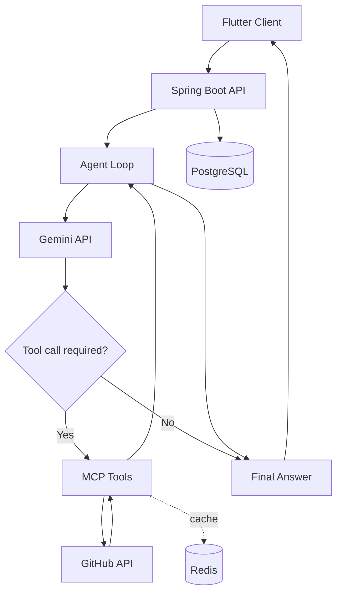
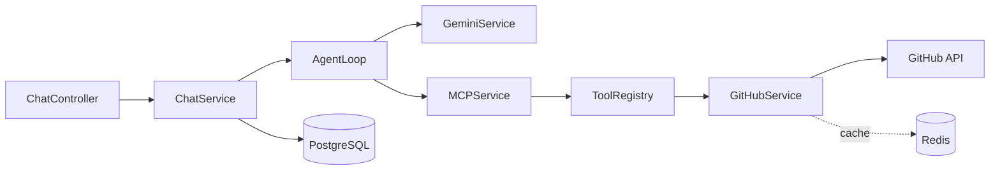
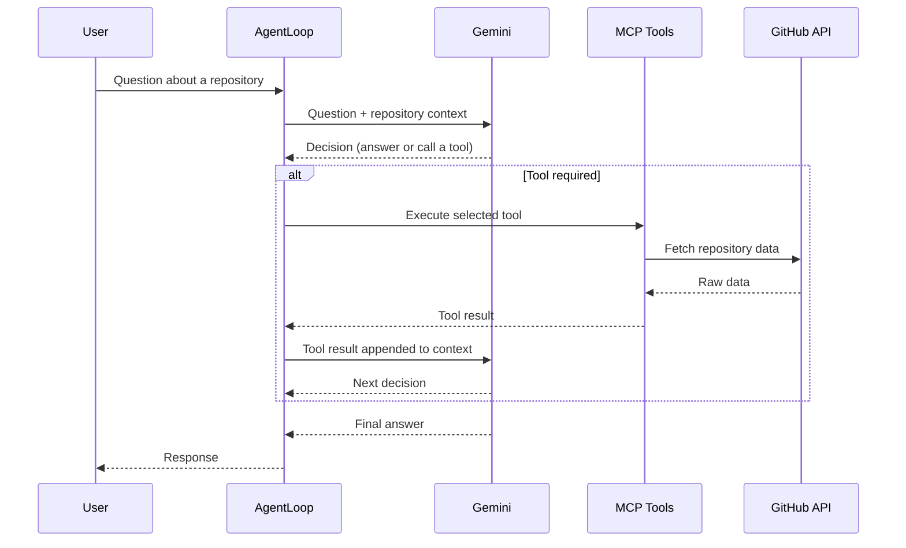

# Rippo

> AI-powered cross-platform GitHub repository assistant.

<p align="left">
  
  
  
  
  
  
  
  
</p>

Rippo is an AI-powered GitHub repository assistant that lets developers explore repositories,
navigate project structures, inspect source code, and ask questions about a codebase in natural
language. Rather than relying only on a language model's prior knowledge, Rippo uses an
MCP-inspired tool architecture that retrieves live repository data before the model answers.

The project focuses on accurate repository understanding, a modular tool layer, and a
production-oriented Spring Boot backend backed by PostgreSQL and an optional Redis cache.

---

## Table of Contents

- [Overview](#overview)
- [Download APK](#download-apk)
- [Features](#features)
- [Tech Stack](#tech-stack)
- [Architecture](#architecture)
  - [High-Level Flow](#high-level-flow)
  - [Backend Components](#backend-components)
- [Repository Capabilities](#repository-capabilities)
- [AI Workflow](#ai-workflow)
- [Caching Layer](#caching-layer)
- [Project Structure](#project-structure)
- [API Overview](#api-overview)
- [Installation](#installation)
- [Environment Variables](#environment-variables)
- [Screenshots](#screenshots)
- [Roadmap](#roadmap)
- [Contributing](#contributing)
- [License](#license)

---

## Overview

Rippo connects a Flutter client to a Spring Boot backend that authenticates against GitHub,
reads repository data through the GitHub REST API, and answers questions using the Gemini API
(Gemini 2.5 Flash). The backend exposes a small set of tools (repository metadata, README,
directory listing, file content) that the model can call autonomously during a conversation. Tool
calls are executed server-side, and the results are fed back to the model so its answers are
grounded in the actual contents of the repository being discussed.

Conversations are persisted in PostgreSQL, and repository reads are cached in Redis to reduce
GitHub API traffic. GitHub remains the source of truth; Redis is strictly an optimization layer
that the system can operate without.

The backend is deployed on Railway, with PostgreSQL hosted on Supabase and Redis on Upstash. The
Flutter client connects to this production backend.

---

## Download APK

A preview build of the Android app is available for testing:

**[Download Rippo APK](https://drive.google.com/file/d/1TJXBbmeMLHALiqmQ6an6Bt6xljaEBAAM/view?usp=sharing)**

This is a preview/testing build intended for collecting early feedback. It connects to the
production backend deployed on Railway. The frontend is a temporary showcase UI, so some rough
edges are expected and behavior may change between builds.

---

## Features

| Feature | Description |
| --- | --- |
| GitHub OAuth authentication | Sign in with a GitHub account using the OAuth2 authorization flow. |
| Repository explorer | List the authenticated user's repositories. |
| Repository metadata | Retrieve name, owner, description, default branch, language, visibility, stars, forks, and open issues. |
| README viewer | Fetch and decode a repository's README. |
| Directory navigation | Browse folders and files at any path in a repository. |
| Source code viewer | Read individual file contents (up to a 1 MB limit). |
| AI repository chat | Ask questions about a repository in natural language. |
| Autonomous tool calling | The model decides when to call tools to gather repository data. |
| Persistent chat sessions | Create and reuse chat sessions scoped to a repository. |
| Chat history storage | Messages are stored in PostgreSQL. |
| Redis caching | Repository metadata, README, directory listings, and file contents are cached. |
| Modular MCP tool layer | Tools are registered independently and discovered at runtime. |
| REST API | A documented set of endpoints for repositories, chat, and tools. |

---

## Tech Stack

**Frontend**

| Technology | Purpose |
| --- | --- |
| Flutter | Cross-platform UI |
| Dart | Application language |

**Backend**

| Technology | Purpose |
| --- | --- |
| Spring Boot 3.5 | Application framework |
| Java 17 | Language |
| PostgreSQL (Supabase) | Primary data store |
| Redis (Upstash) | Optional cache |
| Flyway | Database migrations |
| Spring WebFlux `WebClient` | GitHub API calls |

**Authentication**

| Technology | Purpose |
| --- | --- |
| GitHub OAuth | User sign-in and API access tokens |

**AI**

| Technology | Purpose |
| --- | --- |
| Gemini 2.5 Flash | Language model |
| MCP-inspired tool calling | Grounded repository retrieval |

**Deployment**

| Technology | Purpose |
| --- | --- |
| Railway | Backend hosting |
| Supabase | Managed PostgreSQL |
| Upstash | Managed Redis |

**Developer Tools**

| Technology | Purpose |
| --- | --- |
| Git & GitHub | Version control |
| Maven | Backend build |

---

## Architecture

### High-Level Flow



### Backend Components

The backend is organized around a clear request path. Each component has a single responsibility.



| Component | Responsibility |
| --- | --- |
| `ChatController` | Handles HTTP chat requests, resolves the authenticated user and GitHub access token, and delegates to `ChatService`. |
| `ChatService` | Orchestrates a chat turn: loads session context, invokes the agent loop, and persists messages. |
| `AgentLoop` | Drives the iterative reasoning cycle — sends context to the model, interprets tool-call decisions, executes tools, and feeds results back until a final answer is produced. |
| `GeminiService` | Wraps calls to the Gemini API, including request construction and retry handling. |
| `MCPService` | Exposes available tool definitions and executes tool requests against the registry. |
| `ToolRegistry` | Registers and resolves the available MCP tools (`repository_info`, `read_file`, `list_directory`, `readme`). |
| `GitHubService` | The single point of contact with the GitHub API. Decides whether to serve data from Redis or fetch from GitHub, and applies caching transparently. |

---

## Repository Capabilities

Rippo can work with any repository the authenticated user can access on GitHub.

- **Explore repositories** — list the repositories available to the signed-in account.
- **Read README files** — fetch and decode the README for a repository.
- **Navigate folders** — list the contents of any directory, including nested paths.
- **Inspect source code** — read the contents of an individual file.
- **Answer repository questions** — respond to natural-language questions using data retrieved
  through the tool layer rather than assumptions.
- **Maintain conversation context** — chat sessions are scoped to a repository and their history
  is stored, so follow-up questions build on earlier turns.

---

## AI Workflow

A single question can involve several tool calls before the model produces an answer. The agent
loop continues until the model decides no further tools are needed.



The model autonomously decides whether tool execution is required. Simple questions may be
answered directly, while questions that depend on repository contents trigger one or more tool
calls before a grounded answer is returned.

---

## Caching Layer

Redis was introduced to reduce repeated GitHub API calls during a conversation. When a user asks
several questions about the same repository, the agent often re-reads the same metadata, README,
directories, and files. Caching those reads keeps interactions responsive and reduces the risk of
hitting GitHub rate limits.

Cached data:

| Cached data | Default TTL | Cache key pattern |
| --- | --- | --- |
| Repository metadata | 1 hour | `repo:{owner}:{name}:metadata` |
| README | 6 hours | `repo:{owner}:{name}:readme` |
| Directory listings | 1 hour | `repo:{owner}:{name}:dir:{path}` |
| File contents | 6 hours | `repo:{owner}:{name}:file:{path}` |

Key points:

- **GitHub is the source of truth.** Redis is an optimization layer only.
- **The cache is transparent.** Caching lives inside `GitHubService`; the tools and the model are
  unaware of where data comes from.
- **Redis is optional.** If Redis is unavailable, the backend logs the condition and falls back to
  GitHub without failing the request.
- **Only successful responses are cached.** Errors such as "not found" or "file too large" are
  never written to Redis.
- **Keys are deterministic.** Directory and file paths are normalized before key generation so
  equivalent paths map to a single entry.

---

## Project Structure

```text
Rippo/
├── backend/                     # Spring Boot service
│   ├── src/main/java/com/rippo/backend/
│   │   ├── ai/                  # Gemini configuration, DTOs, and service
│   │   ├── cache/               # Redis config, CacheProperties, CacheService
│   │   ├── chat/                # Chat controller, agent loop, services, DTOs
│   │   ├── config/              # Security and WebClient configuration
│   │   ├── controller/          # Repository and user REST controllers
│   │   ├── entity/              # JPA entities (User, ChatSession, ChatMessage)
│   │   ├── mcp/                 # MCP controller, registry, tools, DTOs
│   │   ├── repository/          # Spring Data repositories
│   │   └── service/             # GitHubService and supporting services
│   ├── src/main/resources/      # application.yaml and Flyway migrations
│   ├── src/test/                # Unit and integration tests
│   └── pom.xml
└── frontend/                    # Flutter application
    └── lib/                     # Dart source
```

---

## API Overview

All endpoints require an authenticated session established through the GitHub OAuth flow.
Repository and file access use the signed-in user's GitHub access token.

### Authentication

| Method | Endpoint | Description |
| --- | --- | --- |
| `GET` | `/oauth2/authorization/github` | Starts the GitHub OAuth login flow. |
| `GET` | `/user` | Returns the authenticated user's profile. |

### Repositories

| Method | Endpoint | Description |
| --- | --- | --- |
| `GET` | `/repos` | Lists the authenticated user's repositories. |
| `GET` | `/repo/{owner}/{repo}/contents?path=` | Returns repository contents at a path (root when omitted). |
| `GET` | `/repo/{owner}/{repo}/readme` | Returns the decoded README. |
| `GET` | `/repo/{owner}/{repo}/commits` | Returns recent commits. |
| `GET` | `/repo/{owner}/{repo}/file?path=` | Returns the contents of a single file. |

### Chat

| Method | Endpoint | Description |
| --- | --- | --- |
| `POST` | `/chat/sessions` | Creates a chat session scoped to a repository. |
| `POST` | `/chat` | Sends a message and returns the assistant's response. |

Example request body for `POST /chat`:

```json
{
  "repositoryOwner": "octocat",
  "repositoryName": "hello-world",
  "chatSessionId": 1,
  "message": "What does the main service class do?"
}
```

### MCP

| Method | Endpoint | Description |
| --- | --- | --- |
| `GET` | `/mcp/tools` | Lists the available tool definitions. |
| `POST` | `/mcp/tools/execute` | Executes a named tool with arguments. |

Example request body for `POST /mcp/tools/execute`:

```json
{
  "name": "read_file",
  "arguments": {
    "repositoryOwner": "octocat",
    "repositoryName": "hello-world",
    "path": "src/main/App.java"
  }
}
```

---

## Installation

### Prerequisites

- Java 17
- Maven (the included wrapper `mvnw` / `mvnw.cmd` can be used instead)
- Flutter SDK
- A PostgreSQL database (Supabase or local)
- A GitHub OAuth application
- A Gemini API key
- Redis (optional)

### 1. Clone the repository

```bash
git clone https://github.com/your-username/rippo.git
cd rippo
```

### 2. Configure a GitHub OAuth application

In GitHub, open **Settings → Developer settings → OAuth Apps** and create a new app. Set the
authorization callback URL to match your backend host (for local development, the Spring Security
default is `http://localhost:8080/login/oauth2/code/github`). Note the client ID and secret.

### 3. Backend

Create a `.env` file in `backend/` (see [Environment Variables](#environment-variables)), then run:

```bash
cd backend
./mvnw spring-boot:run
```

On Windows:

```bat
cd backend
mvnw.cmd spring-boot:run
```

Flyway applies the database migrations automatically on startup.

To run the tests:

```bash
./mvnw test
```

### 4. Frontend

```bash
cd frontend
flutter pub get
flutter run
```

### Database

Rippo uses PostgreSQL with a dedicated `rippo` schema. Migrations are managed by Flyway and run
automatically when the backend starts, so no manual schema setup is required. Point the backend at
your database using the `SUPABASE_DB_*` (or `DATABASE_*`) environment variables.

### Redis

Redis is optional. Provide connection details through the `REDIS_*` variables to enable caching.
If Redis is not reachable, the backend continues to serve requests directly from GitHub.

### Gemini API

Obtain an API key from Google AI Studio and set it as `GEMINI_API_KEY`. The model and generation
parameters are configured in `application.yaml`.

---

## Environment Variables

These are read by the backend at startup. Copy `backend/.env.example` to `backend/.env` and fill
in the values.

| Variable | Required | Description |
| --- | --- | --- |
| `SUPABASE_DB_URL` | Yes | JDBC connection string for PostgreSQL. |
| `SUPABASE_DB_USERNAME` | Yes | Database username. |
| `SUPABASE_DB_PASSWORD` | Yes | Database password. |
| `DATABASE_URL` / `DATABASE_USERNAME` / `DATABASE_PASSWORD` | No | Fallback database settings. |
| `GITHUB_CLIENT_ID` | Yes | GitHub OAuth app client ID. |
| `GITHUB_CLIENT_SECRET` | Yes | GitHub OAuth app client secret. |
| `GEMINI_API_KEY` | Yes | Gemini API key. |
| `REDIS_HOST` | No | Redis host (default `localhost`). |
| `REDIS_PORT` | No | Redis port (default `6379`). |
| `REDIS_PASSWORD` | No | Redis password, if required. |
| `REDIS_SSL_ENABLED` | No | Enable TLS for Redis (required by managed providers such as Upstash). Default `false`. |
| `REDIS_CONNECT_TIMEOUT` | No | Redis connect timeout (default `2s`). |
| `REDIS_TIMEOUT` | No | Redis command timeout (default `2s`). |
| `CACHE_DEFAULT_TTL` | No | Default cache TTL (default `10m`). |
| `CACHE_REPOSITORY_METADATA_TTL` | No | Metadata cache TTL (default `1h`). |
| `CACHE_README_TTL` | No | README cache TTL (default `6h`). |
| `CACHE_DIRECTORY_TTL` | No | Directory cache TTL (default `1h`). |
| `CACHE_FILE_TTL` | No | File cache TTL (default `6h`). |

---

## Screenshots

Screenshots will be added here.

| View | Preview |
| --- | --- |
| Login | _Coming soon_ |
| Home | _Coming soon_ |
| Repository | _Coming soon_ |
| AI Chat | _Coming soon_ |
| Code Viewer | _Coming soon_ |

---

## Roadmap

**Completed**

- [x] GitHub OAuth authentication
- [x] Repository navigation
- [x] AI-powered repository chat
- [x] MCP-inspired tool layer
- [x] Redis caching (metadata, README, directory, and file contents)
- [x] Dark-themed Flutter client (temporary showcase build)
- [x] Cloud deployment (Railway, Supabase, Upstash)

**Upcoming**

- [ ] Final frontend redesign
- [ ] Conversation sidebar
- [ ] Repository search
- [ ] Multi-model support

---

## Contributing

Contributions are welcome. To propose a change:

1. Fork the repository and create a feature branch from `main`
   (for example, `git checkout -b feature/repository-search`).
2. Make your changes, keeping them focused and consistent with the existing structure and style.
3. Add or update tests where it makes sense, and run the backend test suite with `./mvnw test`.
4. Use clear, descriptive commit messages.
5. Open a pull request that explains what changed and why. Link any related issues.

For larger changes, please open an issue first to discuss the approach. Bug reports and feature
requests are also welcome through the issue tracker.

---

## License

This project is licensed under the MIT License. See the [LICENSE](LICENSE) file for details.
